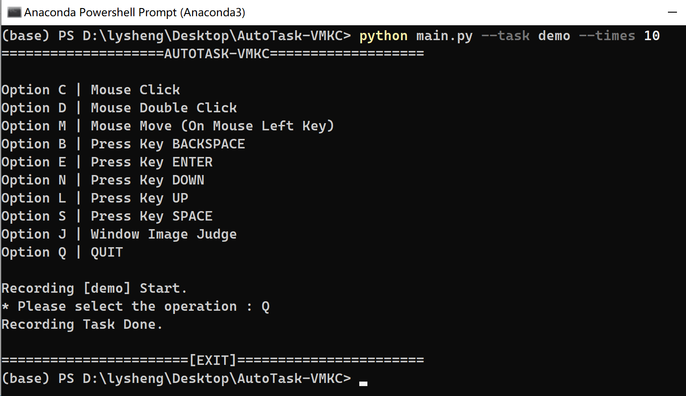

<div id="top"></div>

<!-- 项目 SHIELDS -->
[![Contributors][contributors-shield]][contributors-url]
![MIT License][license-shield]

<!-- 项目 LOGO -->
<div align="center">
  <h3 align="center">AutoTask-VMKC</h3>
  <p align="center">
    实现模拟键鼠操作的自动化流程脚本
    <br />
    <br />
    <a href="https://github.com/lyshengtr/AutoTask-VMKC/issues">反馈 Bug</a>
    ·
    <a href="https://github.com/lyshengtr/AutoTask-VMKC/issues">请求新功能</a>
  </p>

</div>

<!-- 关于本项目 -->

## 关于本项目

我们在工作中可能会遇到重复性的图形化操作流程，对于一部分无法直接调用API来实现自动操作的情况，则希望可以用虚拟键鼠来代替我们进行重复的点击、拖拽、键入等系列操作。

本项目实现了模拟键鼠的基础操作，并且能够自定义记录一项任务的一整套操作流程，进而自动完成重复性的图形化操作。

当然，项目目前仍有许多值得改进的地方，例如：首次记录操作的方式，需要做的更加简单易用；键盘、鼠标的操作需要更加完善，目前键盘键入仅支持几个特殊功能键（原因是现在只能通过有限的字母来记录操作）。

<p align="right">(<a href="#top">回到顶部</a>)</p>

<!-- 安装 -->

## 安装

克隆仓库（repo），并在 [Python>=3.8.0](https://www.python.org) 的环境中安装 [requirements](requirements.txt) 所需的依赖。目前仅支持Windows平台。
```sh
git clone https://github.com/lyshengtr/AutoTask-VMKC.git
cd AutoTask-VMKC
pip install -r requirements.txt
```

<!-- 使用方法 示例 -->
## 使用方法

- 记录操作流程

  运行 main.py 来记录需要自动操作的一系列流程，可选参数有：--task（任务名称，默认为"auto-task-demo"）、--times（任务重复执行的次数，默认为无限次）。

  ```sh
  python main.py --task name --times num
  ```

  该脚本执行后，在CMD窗口中选择对应的操作，退出时会根据记录的操作，生成新的自动执行脚本文件。

  

  注：所有的鼠标操作，目前默认绑定为左键，使用时在输入指令后，将鼠标移动至需要的位置（仅移动位置，不做其他操作），再键入回车，即会执行并记录。而所有的键盘操作，目前仅做记录，不在记录时执行。

- 开始自动操作

  执行上一步生成的脚本文件即可。

  ```sh
  python auto-task-demo.py
  ```

- 修改相关参数

  在面对部分需要等待弹窗确定后再操作的情况时，脚本采取了图像暴力比较的办法（但必须要求弹窗位置固定），可以在使用时，根据实际情况修改 vmkc.py 中的参数`DIFF_THRESHOLD`（数值越小越严苛），使得识别效果更好。

  另外，可以运行 cursor.py 工具来实时获取鼠标位置，在生成的脚本文件中，自定义修改一些指令（例如，当大部分流程相同，仅操作位置不同的时候，直接修改比重新记录一遍要更加便捷）。


<p align="right">(<a href="#top">返回顶部</a>)</p>

<!-- 贡献 -->

## 贡献

如果你有好的建议，请复刻（fork）本仓库并且创建一个拉取请求（pull request）。你也可以简单地创建一个议题（issue），并且添加标签「enhancement」。如果你觉得项目有用，不要忘记给项目点一个 star！再次感谢！

1. 复刻（Fork）本项目
2. 创建你的 Feature 分支 (`git checkout -b feature/AmazingFeature`)
3. 提交你的变更 (`git commit -m 'Add some AmazingFeature'`)
4. 推送到该分支 (`git push origin feature/AmazingFeature`)
5. 创建一个拉取请求（Pull Request）

<p align="right">(<a href="#top">回到顶部</a>)</p>

<!-- 许可证 -->

## 许可证

根据 MIT 许可证分发。打开 [LICENSE](LICENSE) 查看更多内容。

<p align="right">(<a href="#top">回到顶部</a>)</p>

<!-- 联系我们 -->

## 联系我们

lysheng - lyshengtr@outlook.com

项目链接: [https://github.com/lyshengtr/AutoTask-VMKC](https://github.com/lyshengtr/AutoTask-VMKC)

<p align="right">(<a href="#top">回到顶部</a>)</p>


[contributors-shield]: https://img.shields.io/github/contributors/lyshengtr/AutoTask-VMKC.svg?style=for-the-badge
[contributors-url]: https://github.com/lyshengtr/AutoTask-VMKC/graphs/contributors
[forks-shield]: https://img.shields.io/github/forks/lyshengtr/AutoTask-VMKC.svg?style=for-the-badge
[forks-url]: https://github.com/lyshengtr/AutoTask-VMKC/network/members
[stars-shield]: https://img.shields.io/github/stars/lyshengtr/AutoTask-VMKC.svg?style=for-the-badge
[stars-url]: https://github.com/lyshengtr/AutoTask-VMKC/stargazers
[issues-shield]: https://img.shields.io/github/issues/lyshengtr/AutoTask-VMKC.svg?style=for-the-badge
[issues-url]: https://github.com/lyshengtr/AutoTask-VMKC/issues
[license-shield]: https://img.shields.io/github/license/lyshengtr/AutoTask-VMKC.svg?style=for-the-badge
[license-url]: https://github.com/lyshengtr/AutoTask-VMKC/LICENSE
